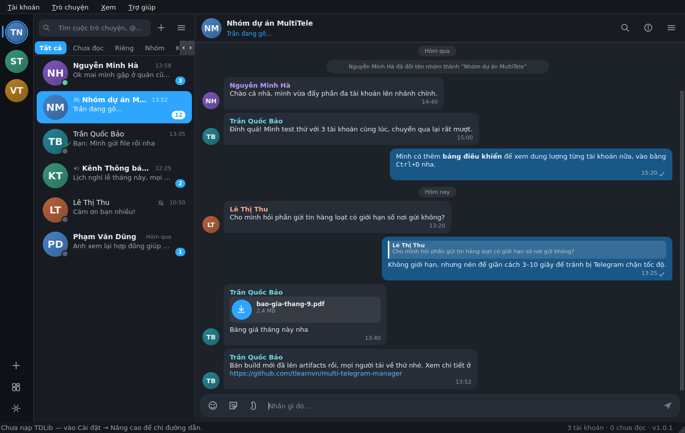
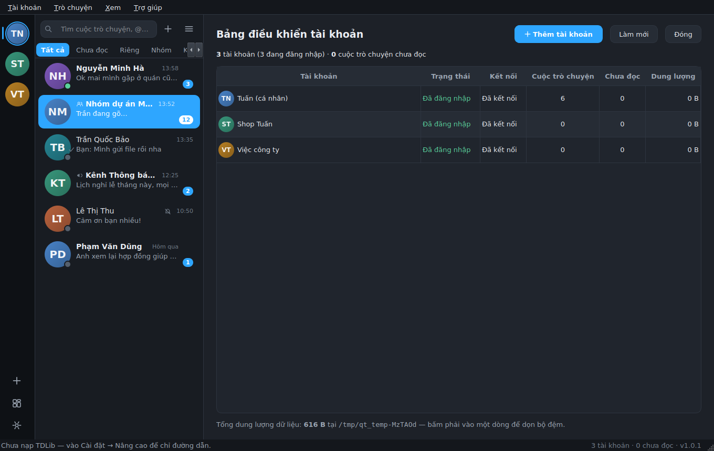
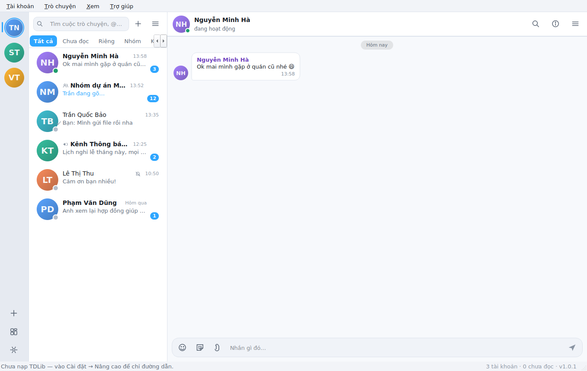

# Tuấn' MultiTele Client

Trình khách Telegram **đa tài khoản** cho máy tính, viết bằng **C++17 / Qt 6**,
giao diện **native** và **hoàn toàn tiếng Việt**.

Điểm khác biệt: **mọi dữ liệu nằm cạnh tệp chạy**. Copy cả thư mục sang máy
khác hay để trong USB là dùng được ngay, không mất phiên đăng nhập, không để
lại gì trong registry hay thư mục người dùng.

```
TuanMultiTeleClient/
├── TuanMultiTeleClient(.exe)   ← tệp chạy
├── lib/                        ← Qt + TDLib đóng kèm
└── data/                       ← TẤT CẢ dữ liệu ở đây
    ├── config.ini              ← cấu hình
    ├── accounts.json           ← danh sách tài khoản
    ├── accounts/tk01/…         ← phiên đăng nhập + DB của từng tài khoản
    ├── cache/                  ← ảnh, avatar
    ├── downloads/              ← tệp tải về
    └── logs/                   ← bản ghi hoạt động
```



<details>
<summary>Xem thêm ảnh: bảng điều khiển tài khoản và chủ đề sáng</summary>





</details>

## Tính năng

**Đa tài khoản — điểm mạnh chính**

- Bao nhiêu tài khoản cũng được, **tất cả trực tuyến cùng lúc** (mỗi tài khoản
  là một client TDLib riêng, thư mục dữ liệu riêng).
- Thanh dọc bên trái: avatar từng tài khoản, huy hiệu số tin chưa đọc, đốm màu
  báo trạng thái kết nối. Bấm là chuyển, `Ctrl+1…9` để nhảy nhanh.
- Nhãn và màu nhấn riêng cho từng tài khoản để không nhầm lẫn.
- **Bảng điều khiển** (`Ctrl+D`): trạng thái, số chat, tin chưa đọc, dung lượng
  đĩa của từng tài khoản; đăng xuất / xoá / dọn bộ đệm ngay tại đó.
- **Gửi tin hàng loạt**: một nội dung (kèm tệp) tới nhiều cuộc trò chuyện trên
  nhiều tài khoản, có giãn cách chống giới hạn tốc độ và nhật ký từng nơi gửi.

**Trò chuyện**

- Danh sách chat sắp xếp như Telegram (ghim lên đầu), bộ lọc nhanh: tất cả /
  chưa đọc / riêng tư / nhóm / kênh / bot / lưu trữ.
- Tìm kiếm cục bộ và tìm kênh–nhóm công khai trên máy chủ.
- Nhắn tin có định dạng Markdown, trả lời, sửa, xoá (ở tôi / ở mọi người),
  chuyển tiếp, ghim, chọn nhiều tin, chép, nháp được giữ lại.
- Ảnh – video – nhãn dán – ảnh động hiển thị ngay trong bong bóng; tệp, nhạc,
  tin thoại hiện thẻ có nút tải kèm tiến trình.
- Kéo–thả tệp hoặc dán ảnh từ clipboard để gửi.
- Dấu đã gửi / đã đọc, chỉ báo "đang gõ…", dải phân cách ngày, lượt xem của kênh.
- **Phản ứng**: bấm phải một tin rồi chọn trong bộ 8 emoji hay dùng; bỏ phản
  ứng cũng ở đó.
- **Gửi nhãn dán**: bảng nhãn dán dùng gần đây và nhãn dán yêu thích, lấy trực
  tiếp từ tài khoản Telegram của bạn.
- Bảng thông tin: chi tiết cuộc trò chuyện, danh sách thành viên (bấm đôi để
  nhắn riêng), tắt tiếng, chặn, rời nhóm, xoá lịch sử.
- Tạo nhóm, tạo kênh / nhóm lớn, tham gia bằng liên kết mời hoặc `@tên`.
- Danh bạ, tìm theo `@tên`, mở trò chuyện riêng.

**Giao diện**

- Chủ đề **tối / sáng / theo hệ thống**, 7 màu nhấn, cỡ chữ 80–150%.
- Bộ biểu tượng **vẽ bằng QPainter** — không tệp ảnh ngoài, nét ở mọi mức DPI,
  tự đổi màu theo chủ đề.
- Bảng emoji có nhóm và lịch sử dùng gần đây; bảng nhãn dán ngay cạnh.
- Biểu tượng khay hệ thống, thông báo desktop, đóng cửa sổ vẫn giữ trực tuyến.

**Đăng nhập**

- Bằng **mã QR** (bộ tạo mã QR tự viết theo ISO/IEC 18004, không cần thư viện
  ngoài) hoặc bằng số điện thoại + mã xác thực + mật khẩu hai lớp.
- Proxy SOCKS5 / HTTP / MTProto dùng chung cho mọi tài khoản.

## Những gì bản này CHƯA làm được

Nói thẳng để bạn không mất thời gian tìm:

| Chưa có | Vì sao |
| --- | --- |
| Gọi thoại / gọi video | Cần libtgvoip + tgcalls và xử lý âm thanh–hình ảnh thời gian thực, là một khối lượng công việc riêng. |
| Ghi và gửi tin thoại | Nghe tin thoại thì được, còn ghi cần bắt âm thanh và mã hoá Opus. |
| Trò chuyện mật (secret chat) | TDLib hỗ trợ, nhưng phiên mật gắn với một thiết bị nên không phù hợp với bản cơ động chạy từ USB. |
| Nhãn dán động chạy hoạt ảnh | `.tgs` là Lottie nén gzip; bản này hiện ảnh tĩnh thay vì phát hoạt ảnh. |
| Thư mục chat của Telegram | Bộ lọc nhanh là của riêng ứng dụng, chưa đồng bộ thư mục đặt trên máy chủ. |

Còn lại — nhắn tin, tệp, ảnh, nhãn dán, phản ứng, nhóm, kênh, danh bạ, tìm
kiếm, proxy, đa tài khoản — đều dùng được.

## Tải về

Bản dựng sẵn cho **Windows 64-bit** và **Debian/Linux 64-bit** nằm ở trang
[Releases](https://github.com/tlearnvn/multi-telegram-manager/releases), hoặc
lấy từ artifacts của workflow *Build*.

| Nền tảng | Tệp | Cách chạy |
|---|---|---|
| Windows 10/11 64-bit | `…-win-x64.zip` | Giải nén rồi chạy `TuanMultiTeleClient.exe` |
| Debian 12+, Ubuntu 22.04+ 64-bit | `…-linux-x64.tar.gz` | Giải nén rồi chạy `./chay-ung-dung.sh` |

> Giải nén vào thư mục **có quyền ghi** (Desktop, `~/Ứng dụng`, USB…). Nếu để
> trong `C:\Program Files` hay `/usr/bin`, ứng dụng vẫn chạy nhưng dữ liệu sẽ
> chuyển sang thư mục người dùng và mất tính cơ động.

## Chuẩn bị lần đầu (2 phút)

Ứng dụng có trình hướng dẫn tiếng Việt ngay khi mở lần đầu. Hai thứ cần có:

1. **`api_id` và `api_hash` của riêng bạn** — Telegram bắt buộc mỗi ứng dụng
   phải có khoá riêng. Vào <https://my.telegram.org> → *API development tools*
   → điền tên bất kỳ, nền tảng *Desktop* → sao chép hai giá trị vào trình
   hướng dẫn. Khoá lưu trong `data/config.ini`, **không chia sẻ cho ai**.

2. **Thư viện TDLib** (`tdjson.dll` / `libtdjson.so`) — phần lo giao tiếp với
   máy chủ Telegram. Các bản tải về ở trên **đã đóng kèm sẵn**; nếu tự build
   thì đặt tệp này cạnh tệp chạy hoặc trong `lib/`, hoặc trỏ đường dẫn trong
   *Cài đặt → Nâng cao*.

Xem hướng dẫn chi tiết bằng tiếng Việt: [`docs/HUONG-DAN.md`](docs/HUONG-DAN.md).

## Phím tắt

| Phím | Việc |
|---|---|
| `Ctrl+1` … `Ctrl+9` | Chuyển sang tài khoản thứ n |
| `Ctrl+Tab` | Tài khoản kế tiếp |
| `Ctrl+F` | Tìm cuộc trò chuyện |
| `Ctrl+Shift+F` | Tìm trong cuộc trò chuyện đang mở |
| `Ctrl+Shift+↓` | Cuộc trò chuyện chưa đọc kế tiếp |
| `Ctrl+N` | Trò chuyện mới |
| `Ctrl+Shift+N` | Thêm tài khoản |
| `Ctrl+D` | Bảng điều khiển tài khoản |
| `Ctrl+I` | Bật/tắt bảng thông tin |
| `Ctrl+Shift+T` | Đổi chủ đề sáng ↔ tối |
| `Ctrl+,` | Cài đặt |
| `Enter` / `Shift+Enter` | Gửi / xuống dòng |
| `Esc` | Đóng bảng đang mở, bỏ trả lời, bỏ sửa |

## Tự build

Cần **CMake ≥ 3.19**, trình biên dịch **C++17**, **Qt ≥ 6.3**
(Debian 12 và Ubuntu 24.04 có sẵn Qt 6.4).

```bash
# Debian / Ubuntu
sudo apt install build-essential cmake ninja-build qt6-base-dev libgl1-mesa-dev

git clone https://github.com/tlearnvn/multi-telegram-manager.git
cd multi-telegram-manager
cmake -S . -B build -G Ninja -DCMAKE_BUILD_TYPE=Release
cmake --build build -j$(nproc)
./build/bin/TuanMultiTeleClient
```

```powershell
# Windows (Visual Studio 2022 + Qt 6.4 msvc2019_64)
cmake -S . -B build -G "Visual Studio 17 2022" -A x64 `
      -DCMAKE_PREFIX_PATH="C:/Qt/6.4.3/msvc2019_64"
cmake --build build --config Release
```

Đóng gói bản cơ động cho Linux:

```bash
./packaging/linux/make-portable.sh build/bin/TuanMultiTeleClient \
    /path/to/Qt/6.4.3/gcc_64 dist/TuanMultiTeleClient-linux-x64
```

### Lấy TDLib

```bash
git clone --depth 1 https://github.com/tdlib/td.git
cmake -S td -B td/build -DCMAKE_BUILD_TYPE=Release -DTD_ENABLE_LTO=OFF
cmake --build td/build --target tdjson -j$(nproc)
cp td/build/libtdjson.so* build/bin/     # đặt cạnh tệp chạy
```

Ứng dụng nạp `tdjson` **lúc chạy** (không liên kết tĩnh), nên nâng cấp TDLib
chỉ là thay tệp thư viện. Cần TDLib ≥ 1.8.0; mã nguồn hỗ trợ cả định dạng
tham số khởi tạo cũ (< 1.8.6) và mới.

## Phiên bản tự tăng

Số phiên bản trong tệp [`VERSION`](VERSION) tự tăng khi mã nguồn thay đổi:

- **Git hook** — cài một lần bằng `./scripts/install-hooks.sh`; từ đó mỗi
  commit chạm vào `src/`, `cmake/`, `packaging/` hay `CMakeLists.txt` sẽ tự
  tăng số **PATCH**.
- **GitHub Actions** — workflow *Build* cũng tự tăng PATCH cho mỗi lần đẩy mã
  rồi commit lại `VERSION` kèm `[skip ci]`.
- Ngoài ra mỗi bản build còn nhúng **số build** (số commit tính từ đầu lịch
  sử), **hash commit** và **ngày build**, nên hai bản build khác nhau không bao
  giờ trùng chuỗi phiên bản:
  `1.0.7 (build 42 · 9f1c2ab0 · 2026-09-02)`.

Tăng MINOR / MAJOR khi cần:

```bash
python3 scripts/bump_version.py --part minor
```

## Xem trước giao diện không cần Telegram

Có sẵn công cụ dựng cửa sổ với dữ liệu mẫu rồi xuất ảnh PNG — tiện để soi giao
diện hoặc kiểm tra sau khi sửa mã, không cần TDLib hay tài khoản thật:

```bash
cmake -S . -B build -G Ninja -DBUILD_UI_PREVIEW=ON
cmake --build build --target tuan_uipreview
QT_QPA_PLATFORM=offscreen ./build/bin/tuan_uipreview /tmp/anh
```

Dữ liệu mẫu được nạp bằng **đúng định dạng JSON mà TDLib gửi**, đi qua đúng hàm
`TdAccount::handleIncoming()` của bản chạy thật — nên công cụ này vừa xem được
giao diện, vừa kiểm tra luôn phần phân tích dữ liệu. Ba ảnh trong `docs/anh`
được tạo bằng chính công cụ này.

## Kiểm tra

Hai bộ kiểm tra, bật bằng `-DBUILD_TESTS=ON`:

```bash
cmake -S . -B build -G Ninja -DBUILD_TESTS=ON
cmake --build build

./build/bin/tuan_selftest                          # không cần TDLib
TDJSON_PATH=/duong/dan/libtdjson.so ./build/bin/tuan_tdcheck
```

- `tuan_selftest` — 65 phép kiểm cho bộ tạo mã QR (đối chiếu ma trận chuẩn),
  các hàm định dạng, tiện ích JSON và lớp phân tích dữ liệu TDLib. Chạy được ở
  mọi máy, không cần thư viện ngoài.
- `tuan_tdcheck` — kiểm **cầu nối tdjson với thư viện thật**: nạp được thư
  viện, gọi được yêu cầu đồng bộ, tạo client rồi đẩy tham số khởi tạo và chờ
  TDLib chuyển sang bước nhập số điện thoại. Ghi vào thư mục tạm và **không cần
  tài khoản thật** — dùng luôn được để kiểm tra xem `libtdjson` bạn vừa đặt vào
  có chạy không.

## Cấu trúc mã nguồn

```
src/
├── main.cpp              khởi tạo theo đúng thứ tự: đường dẫn → log → chủ đề → tài khoản
├── core/                 đường dẫn cơ động, cấu hình, log, tiện ích JSON, định dạng
│   └── qrcode.*          bộ tạo mã QR tự viết (Reed–Solomon + 8 mặt nạ)
├── td/                   lớp giao tiếp TDLib
│   ├── tdloader.*        nạp động tdjson lúc chạy
│   ├── tdtransport.*     MỘT luồng nhận cho cả tiến trình, phân phối theo @client_id
│   ├── tdaccount.*       một tài khoản = một client: đăng nhập, chat, tin nhắn, hành động
│   └── accountmanager.*  danh sách tài khoản, lưu/nạp accounts.json
├── model/                ChatEntry / MessageEntry / UserEntry + hai model cho view
└── ui/                   giao diện: thanh tài khoản, danh sách chat, khung hội thoại,
                          delegate vẽ bong bóng, các hộp thoại, chủ đề, biểu tượng
```

Vì sao chỉ có **một** luồng nhận: `td_receive()` của tdjson trả về phản hồi của
**mọi** client và con trỏ trả về chỉ hợp lệ tới lần gọi kế tiếp *trong cùng
luồng*. `TdTransport` giữ luồng đó, phân tích JSON rồi phát tín hiệu về luồng
giao diện; `AccountManager` chuyển từng phản hồi cho đúng `TdAccount` dựa vào
`@client_id`.

## Bảo mật & lưu ý

- Thư mục `data/accounts` chứa **phiên đăng nhập Telegram**. Ai lấy được thư
  mục đó là truy cập được tài khoản của bạn — giữ USB và bản sao cẩn thận.
- `api_hash` và mật khẩu proxy nằm trong `data/config.ini`. Mật khẩu proxy chỉ
  được làm rối nhẹ, **không phải mã hoá thật**.
- Ứng dụng không gửi dữ liệu đi đâu ngoài máy chủ Telegram.
- Tính năng gửi hàng loạt dễ khiến tài khoản bị Telegram giới hạn hoặc khoá nếu
  dùng để spam. Hãy giữ giãn cách hợp lý và chỉ gửi cho người đã đồng ý nhận.

## Giấy phép

[MIT](LICENSE). Ứng dụng dùng [TDLib](https://github.com/tdlib/td)
(Boost Software License 1.0) và [Qt 6](https://www.qt.io) (LGPL v3) — hai thư
viện này thuộc về tác giả của chúng.
